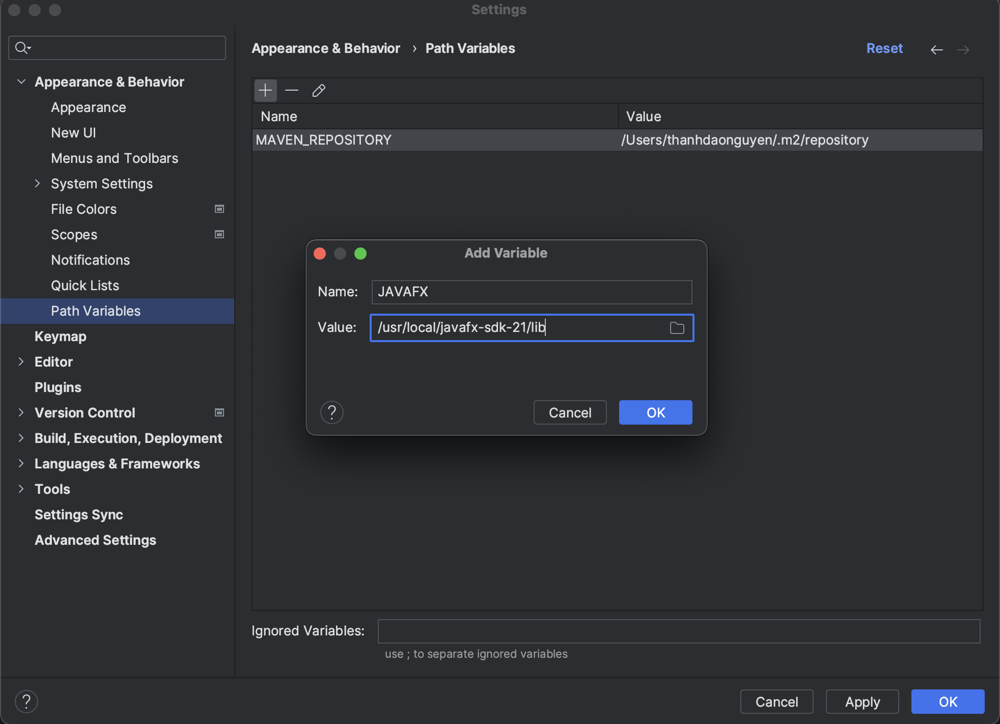

# int2204e_25

INT2204E 25 final project.

## Set up Javafx

### 1. Install `JavaFX-SDK`

- Step 1: Navigate to this link below and download the JavaFX-SDK version compatible with your machine (you can skip this step if JavaFX is installed already in your machine)
    
    https://gluonhq.com/products/javafx/ 

    a guideline video for install and set up JavaFx:  

    https://www.youtube.com/watch?v=Ope4icw6bVk&t=165s&ab_channel=BroCode

- Step 2: Open Intellij IDEA -> Settings -> Appearance & Behavior -> Path Variables

    Here you add a new environment variable named JAVAFX with the value is the path to lib folder of the javafx package installed in step 1
    
